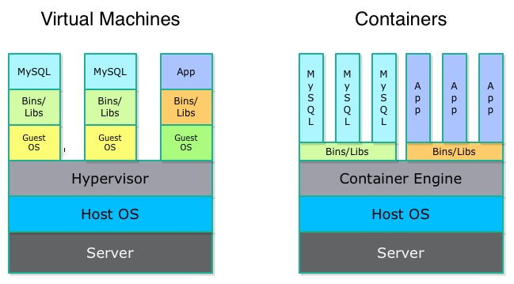
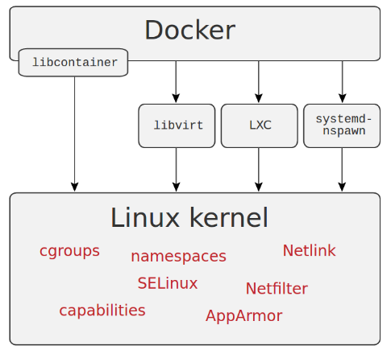

### What are Linux Contianers?


> Before moving on, let’s understand the difference between the containers and the virtual machine. 




http://patg.net/containers,virtualization,docker/2014/06/05/docker-intro/


Linux containers, in short, contain applications in a way that keep them isolated from the host system that they run on. Containers allow a developer to package up an application with all of the parts it needs, such as libraries and other dependencies, and ship it all out as one package. And they are designed to make it easier to provide a consistent experience as developers and system administrators move code from development environments into production in a fast and replicable way.

Note: This is achieved through a combination of kernel security features such as namespaces, mandatory access control and control groups.


### Virtual Machines vs Containers

| Virtual Machines | Containers |
|:----------------------------------------------------------------------------------------------------:|:--------------------------------------------------------------------------------------------------------------------------------------------------------------------------:|
| Includes the application, the necessary binaries and libraries, and an entire guest operating system | Include the application and all of its dependencies, but share the kernel with other containers, running as isolated processes in user space on the host operating system. |
| Tied to platform (virtualization software) | Works everywhere (Computer, Cloud, etc.) |
| Size in GB’s | Size in MB’s |
| Takes minutes to start | Takes seconds to start |
| Costly | Cheaper |


### What is Docker?

Docker is an application that enables build, ship and run your code anywhere. Docker containers wraps your code, runtime, system tools and libraries and creates an image which can be distributed to the others and it guarantees that it will always run regardless of the environment. Docker is originally used LXC (LinuX container) technology, but later switched to runC (known as libcontainer). It uses resource isolation feature of the linux kernel to create a container such as name space, layered filesystem, network space and cgroups, etc.

Learn more about docker here [https://training.docker.com/category/self-paced-online](https://training.docker.com/category/self-paced-online)


### Overview



### Scenario Demo

- How long does it take to setup an wordpress site for you?

```
$ docker run --name mysql -e MYSQL_ROOT_PASSWORD=wordpress -d mysql

$ docker run --name some-wordpress --link mysql:mysql -p 8080:80 -d wordpress
```


### Super cool demo with HTOP

- Running `htop` command in container and assigning host processes (example of giving privileges to containers)

```
$ docker run --rm -it --pid host jess/htop
```
