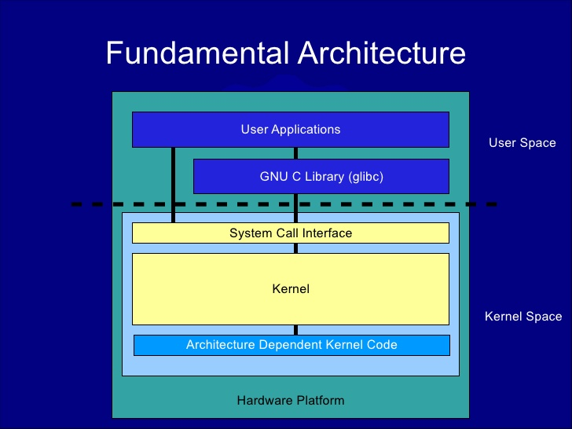

# Linux Architecture

>Linux  is a Unix-like computer operating system assembled under the model of free and open-source software development and distribution. The defining component of Linux is the Linux kernel, an operating system kernel first released on September 17, 1991 by Linus Torvalds.

# 
