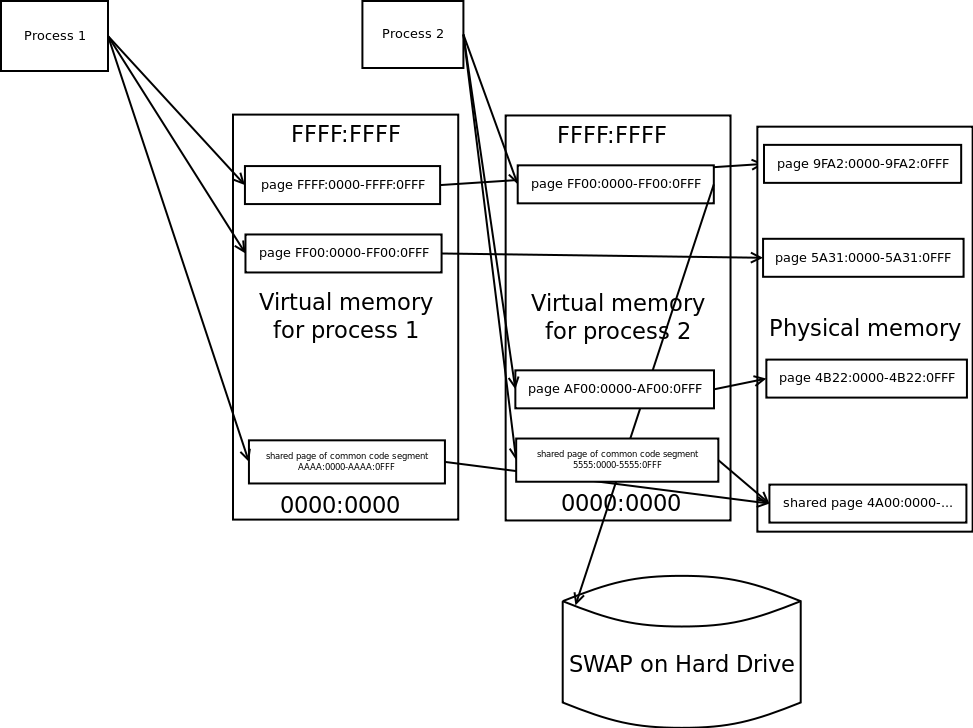

### Linux memory Management

 - Kernel keeps track of all RAM and how it's shared between processes. 
 - The kernel splits the RAM into pages and maintains the state information about these subdivisions at all time.
 - Kernel effectively sandboxes memory of various processes
 - Shared memory is taken from free memory
 - Paging is also handled by kernel

### Kernel Space vs User Space

>Kernel space is strictly reserved for running a privileged operating system kernel, kernel extensions, and most device drivers. In contrast, user space is the memory area where application software and some drivers execute.

No user process can access the Kernel Space. Additionally User space is also sandboxed for each process. Shared memory can be facilitated.


### Virtual Memory



Every process sees only this continuous chunk of Virtual Memory.

### Memory Management Unit


 - The MMU is a unit inside the CPU, and does the Virtual to Physical Address translation.
 - The kernel maintains a page table, which maps a processes virtual addresses to the Physical addresses.
 - Each page has a PTE (Page Table Entry)
 - Each PTE has a PAGE_USER bit to specify if it is user space accessible.


### Page Faults

A page fault occurs when the required page is not loaded in to the memory.

```
ps -eo min_flt,maj_flt,cmd

```
