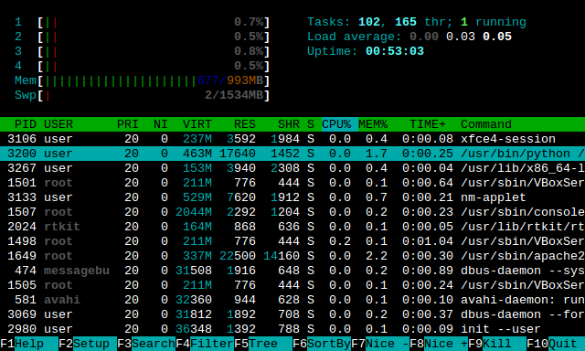

### Process

All processes start as user mode. The kernel isnt a process, it's a controller of processes.

### Process Scheduling:

>The process scheduler is a part of the operating system that decides which process runs at a certain point in time. It usually has the ability to pause a running process, move it to the back of the running queue and start a new process; such a scheduler is known as preemptive scheduler, otherwise it is a cooperative scheduler.

### Context Switching

The process by which the CPU is able to transition into executing another process. 

#### Steps:
1. CPU Stops current operationa and switches to Kernel mode.
2. CPU Records the current state of the CPU and memory.
3. Kernel performs pending tasks (I/O,etc.).
4. Kernel chooses a process based on a scheduling algorithm.
5. Kernel prepares the memory for the next process and starts the next process execution.

