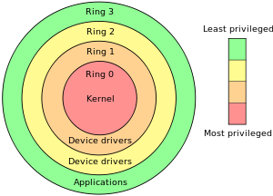

### Protection rings in x86
# 

# 

**Ring 0** is the **kernel** mode. **Ring 3** is the **user** mode. The other rings are not usually used. **Virtualbox** loads the Virtual Machine's Kernel into **Ring 1**.

### Kernel Mode vs User Mode Execution

>In Kernel mode, the executing code has complete and unrestricted access to the underlying hardware. It can execute any CPU instruction and reference any memory address. In User mode, the executing code has no ability to directly access hardware or reference memory. Code running in user mode must delegate to system APIs to access hardware or memory.

These two modes aren't mere labels; they're enforced by the CPU hardware. If code executing in User mode attempts to do something outside its purview-- like, say, accessing a privileged CPU instruction or modifying memory that it has no access to -- a trappable exception is thrown. Instead of your entire system crashing, only that particular application crashes. That's the value of User mode.